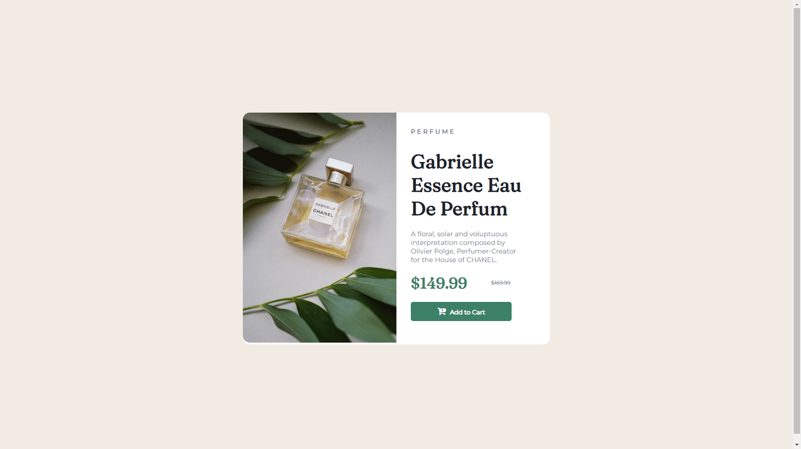

# Product-Preview-Card-ReactJS-Component

This is a solution to the [Product preview card component challenge on Frontend Mentor](https://www.frontendmentor.io/challenges/product-preview-card-component-GO7UmttRfa).

## Table of contents

- [Overview](#overview)
  - [The challenge](#the-challenge)
  - [Screenshot](#screenshot)
  - [Links](#links)
- [My process](#my-process)
  - [Built with](#built-with)
  - [What I learned](#what-i-learned)
  - [Continued development](#continued-development)
  - [Useful resources](#useful-resources)
- [Author](#author)
- [Acknowledgments](#acknowledgments)

**Note: Delete this note and update the table of contents based on what sections you keep.**

## Overview

### The challenge

Users should be able to:

- View the optimal layout depending on their device's screen size
- See hover and focus states for interactive elements

### Screenshot

### Links

- Solution URL: [Github](https://github.com/MiguelR0drigues/Product-Preview-Card-ReactJS-Component)

## My process

### Built with

- Semantic HTML5 markup
- CSS custom properties
- Flexbox
- Mobile-first workflow
- [React](https://reactjs.org/) - JS library + Vite

### What I learned

Stopped using reactJS for a while because I was doing some other projects for university. Remembering now some of the basics.
Getting better and quicker at developing for mobile.

### Continued development

Still to work on remembering the basics of reactJS, forgot some of them already.
Mobile development also needs improvements, trying to figure out best units to work and how to use them.

## Author

- LinkedIn - [@miguel-r0drigues](https://www.linkedin.com/in/miguel-r0drigues/)
- Github - [@MiguelR0drigues](https://github.com/MiguelR0drigues)
- Frontend Mentor - [@MiguelR0drigues](https://www.frontendmentor.io/profile/MiguelR0drigues)
